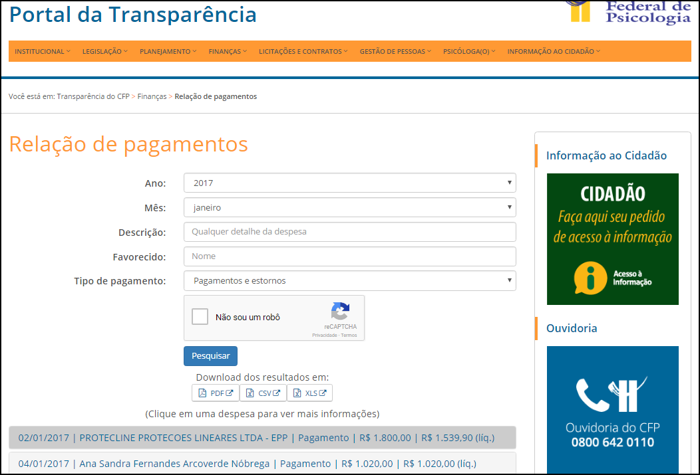
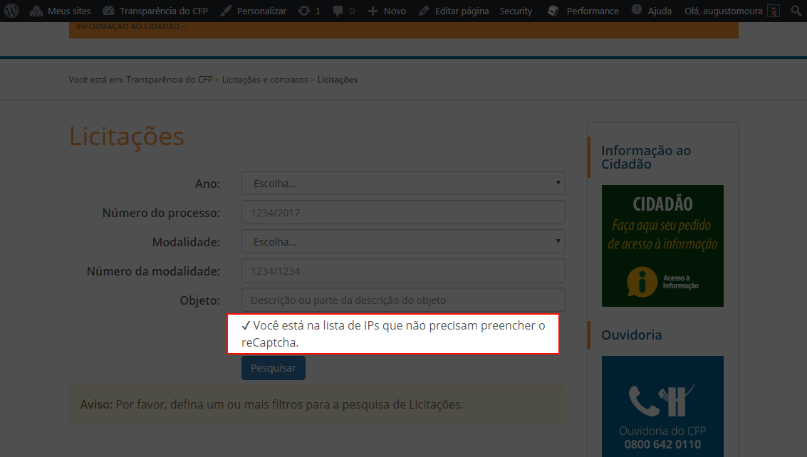

# Páginas integradas

_Inserindo conteúdo de outros sistemas no Portal da Transparência_

No Portal da Transparência há áreas que contêm conteúdo de outros sistemas. A solução integrada possui, entre outras vantagens:

* Possibilidade de pesquisar dados complexos e com **formulários mais dinâmicos**;\
  Ex.: em Relação de Pagamentos, poder pesquisar por favorecido.
* **Integração** com sistemas considerados como padrão no Sistema Conselhos de Psicologia.\
  Ex.: os módulos de Licitação, Contratos e Convênios estão relacionados um com o outro.

Por exemplo, as páginas de Comparativo de Despesa, Comparativo de Receita e Relação de Pagamentos, no Portal da Transparência do CFP, utilizam soluções integradas. Nelas, as informações são procuradas nos bancos de dados preenchidos por outro sistema, o SISCONT.net, e os formulários possuem características dinâmicas.

\
&#xNAN;_&#x45;xemplo de página integrada (com conteúdo do SISCONT.net)_

## Evitar R**eCaptcha**

Nas pesquisas em páginas integradas, existe o uso do **reCaptcha**, cuja utilidade é proteger o servidor do Portal da Transparência de ataques maliciosos.

Os alimentadores de conteúdo, ou seja, os funcionários do CFP e dos CRPs, acessam com bastante frequência essas páginas para fins de testes.

Assim, é oferecida a opção de um regional fornecer seu IP para a Gerência de Tecnologia do CFP, para que ele seja adicionado à ReCaptcha Whitelist, ou seja, **lista de pessoas que não terão que preencher o ReCaptcha**.

Os requisitos são os seguintes:

* Possuir IP estático. Consulte o departamento responsável pela infraestrutura de rede do Conselho Regional em questão para mais informações.
* Enviar um pedido contendo o dito IP estático, juntamente com o nome do funcionário e o número do CRP, para o e-mail [gti.suporte@cfp.org.br](mailto:gti.suporte@cfp.org.br) .

