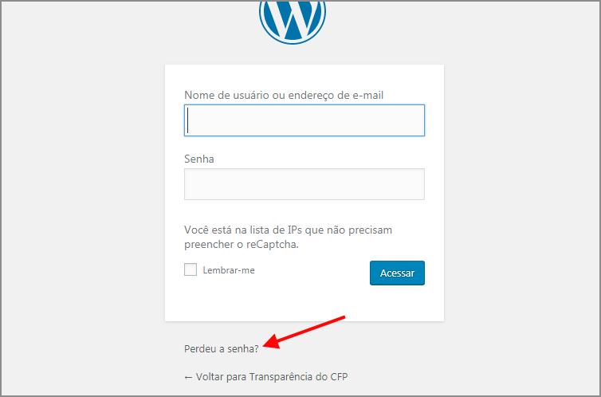
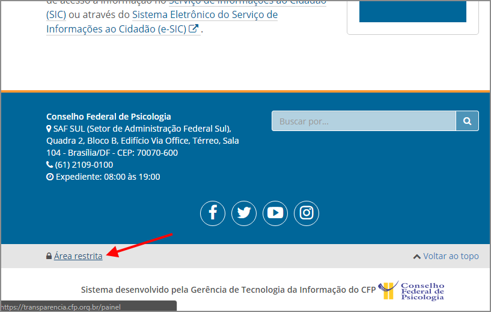
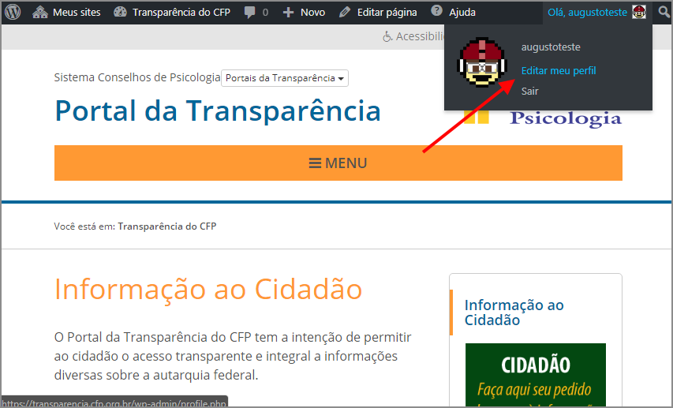
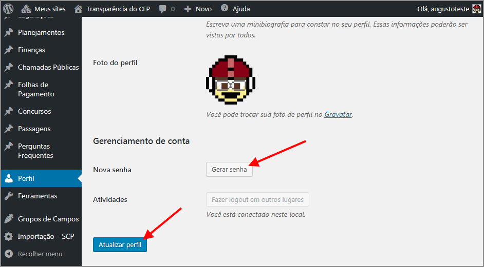

# Trocando sua senha

Se você tiver perdido sua senha, confira a seção \[1]. Se já estiver com login efetuado mas desejar alterar sua senha, confira a seção \[2].

## 1. Perdi minha senha

* Acesse a área restrita clicando em "Área Restrita" no rodapé da página.

.png>)

* Clique em "Perdeu sua senha?".

* Escreva seu login ou e-mail em "Nome de usuário ou endereço de e-mail" e clique em "Obter nova senha".
* Confira a caixa de entrada do seu e-mail e clique no link no e-mail com remetente "Transparência CFP".
* O link abrirá um formulário para redefinir senha. Escreva sua nova senha em "Nova Senha" e clique em "Redefinir senha".

## 2. Sei minha senha, mas quero alterá-la.

* Se ainda não estiver logado, acesse a área restrita clicando em "Área Restrita" no rodapé da página e faça login.

* Abra a página do seu perfil passando o mouse no canto superior direito sobre "Olá, \[seu nome]" e clicando em "Editar meu perfil

* Desça um pouco e clique em "Gerar senha". Você pode usar a senha gerada ou digitar uma nova que desejar. Em seguida, clique em "Atualizar Perfil".

