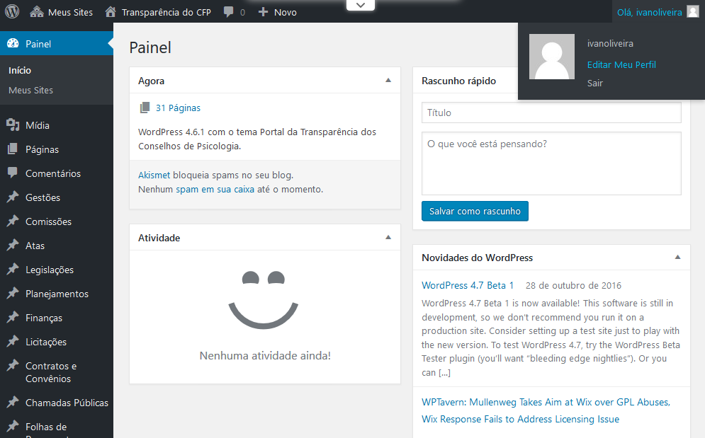

# Conhecendo o painel

Ao entrar na Área restrita você encontra o painel do WordPress, no canto superior direito (onde tem a saudação Olá) você pode editar seu perfil ou sair do painel.

O menu esquerdo é onde você irá publicar os conteúdos para o Portal da Transparência como Gestões, Comissões, Atas e etc.

Na barra superior existe um link com o nome do site (no exemplo acima “Transparência CFP”) onde você alterna entre visitar o site e retornar ao painel.
