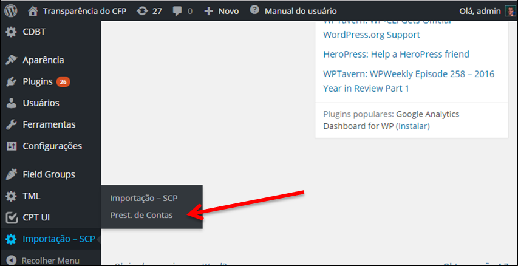
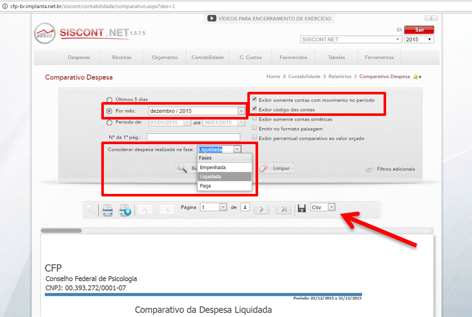
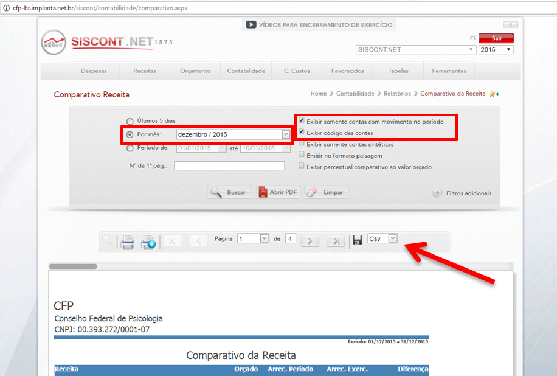
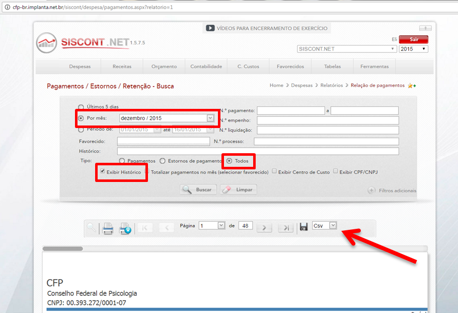
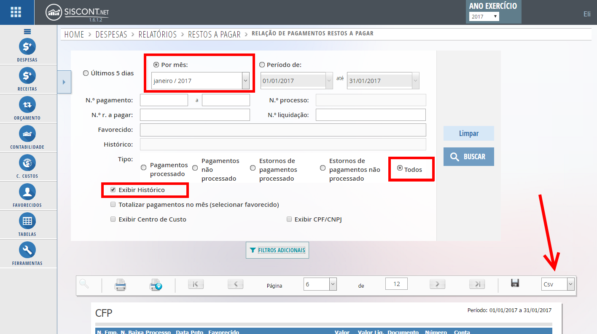
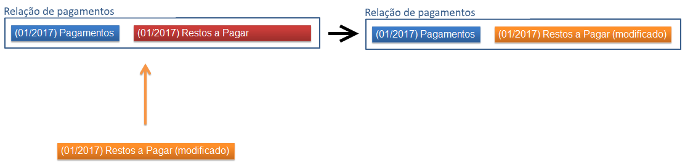
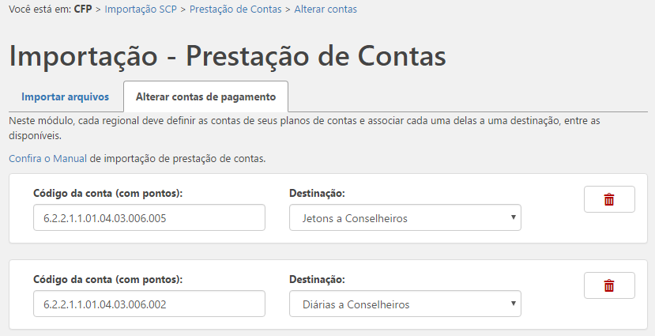
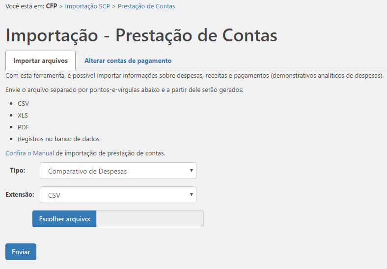

# Prestação de Contas

Os dados de prestação de contas (despesas, receitas e pagamentos) são acessados de modo integrado, havendo necessidade de importação. O módulo pode ser acessado na área de importação no **painel do Wordpress**, no menu à esquerda passando o mouse sobre **"Importação - SCP"** e clicando em **"Prest. de Contas"**. Este menu está disponível apenas para usuários que possuem permissão para alterar dados de Finanças.

\
&#xNAN;_&#x50;lugin de importação do Sistema Conselhos de Psicologia. No menu, a opção Prest. de Contas._

## 1. Exportando prestações de contas no sistema SISCONT

Antes de iniciar a importação, é necessário possuir os arquivos, cada um referente a um mês e ano, de despesas, receitas ou pagamentos, exportados do sistema SISCONT. No sistema SISCONT, efetue o login. Agora você deve pesquisar Despesas/Receitas/Rel.Pagamentos/Restos a Pagar, escolhendo o ano e mês desejados. Para detalhes de como fazê-lo, confira as instruções abaixo.

* Para **Despesas**, vá em Contabilidade -> Relatórios -> Consolidados -> Comparativo da Despesa.
  * No formulário, marque “**Exibir somente contas com movimento no período**” e "**Exibir código das contas**".
  * Escolha a opção “**Por mês**” e escolha um mês e ano desejado.
  * Onde diz “Considerar despesa realizada na fase”, escolha “**Liquidada**”.
  * Execute a pesquisa clicando em “**Buscar**”
  * O resultado vai aparecer abaixo. Imediatamente acima dos resultados, na barra de ações, mude o formato de exportação (na direita) para “**Csv**” e clique no **disquete (** .png>) **)**.
  * Execute os **passos 1.A.**

\
&#xNAN;_&#x46;ormulário de pesquisa de despesas no SISCONT.NET_

* Para **Receitas**, vá em Contabilidade -> Relatórios -> Consolidados -> Comparativo da Receita.
  * No formulário, marque “**Exibir somente contas com movimento no período**” e "**Exibir código das contas**".
  * Escolha a opção “**Por mês**” e escolha um mês e ano desejado.
  * Execute a pesquisa clicando em “**Buscar**”
  * O resultado vai aparecer abaixo. Imediatamente acima dos resultados, na barra de ações, mude o formato de exportação (na direita) para “**Csv**” e clique no **disquete** (  ).
  * Execute os **passos 1.A.**

\
&#xNAN;_&#x46;ormulário de pesquisa de receitas no SISCONT.NET_

* Para **Pagamentos** (demonstrativo analítico de despesas), acesse Despesas -> Relatórios -> Analítico -> Pagamentos / Estornos / Retenção.
  * No formulário, escolha a opção “**Por mês**” e escolha um mês e ano desejado.
  * Em “**Tipo**”, escolha “**Todos**”.
  * Marque a caixa “**Exibir Histórico**”
  * Execute a pesquisa clicando em “**Buscar**”.
  * O resultado vai aparecer abaixo. Imediatamente acima dos resultados, na barra de ações, mude o formato de exportação (na direita) para “**Csv**” e clique no **disquete (** .png>) **)**.
  * Execute os **passos 1.A.**

\
&#xNAN;_&#x46;ormulário de pesquisa de pagamentos no SISCONT.NET_

* Para **Restos a Pagar** (relação de pagamentos - restos a pagar), acesse Despesas -> Relatórios -> Restos a Pagar-> Pagamentos.
  * No formulário, escolha a opção “**Por mês**” e escolha um mês e ano desejado.
  * Em “**Tipo**”, escolha “**Todos**”.
  * Marque a caixa “**Exibir Histórico**”
  * Execute a pesquisa clicando em “**Buscar**”.
  * O resultado vai aparecer abaixo. Imediatamente acima dos resultados, na barra de ações, mude o formato de exportação (na direita) para “**Csv**” e clique no **disquete** ( .png>) ).
  * Execute os **passos 1.A**.

_Formulário de pesquisa de restos pagar no SISCONT.NET_

### 1.A. Passos comuns a todos os tipos de dados

Será aberta uma nova janela com valores separados por ponto-e-vírgula. Agora, clique com o **botão direito do mouse** em qualquer local da página que abriu e clique em “**Selecionar Tudo**”. Com todo o texto selecionado, clique com o **botão direito** novamente e clique em “**Copiar**”.

Abra o programa **Bloco de Notas** e cole o conteúdo clicando com o **botão direito e em “Colar”**. Agora salve o arquivo acessando o menu **“Arquivo”->“Salvar...”** . Você pode salvar com o nome que quiser, mas o recomendado é salvar com a extensão CSV (para isso é necessário mudar o “Tipo”, que está como “Documentos de texto (\*.txt)” para “Todos os arquivos(\*.txt)” e inserir “.csv” ao final do nome do arquivo).

## 2. Formatos aceitos

Os arquivos enviados devem estar no padrão dos CSVs de prestação de contas exportados pelo sistema SISCONT.

Um arquivo deve conter apenas despesas/receitas/pagamentos/restos referentes a um mês. **O sistema** identificará o ano e mês da despesa/receita/pagamento/restos, **removerá os registros que já existem para esse ano e mês específico**, e adicionará os do arquivo. Desse modo, caso um arquivo com erro tenha sido enviado, é possível corrigir o erro e reenviar.

Há uma particularidade sobre os dados de **Pagamentos e Restos a Pagar**: seus relatórios são obtidos em áreas diferentes do SISCONT.NET, como apontado na seção 1, mas são listados juntos no Portal da Transparência. Ao se enviar o arquivo de Restos a Pagar de um determinado mês e ano, serão removidos desse mês e ano apenas os registros de Restos a Pagar que já existam, e os pagamentos normais serão mantidos. Confira o exemplo do diagrama abaixo:

_Diagrama: dinâmica de substituição de Pagamentos e Restos a Pagar_

Confira os arquivos de exemplo fornecidos abaixo.

* [Despesas](http://transparencia.cfp.org.br/wp-content/uploads/documentacao/CRP04-Despesas-052028.csv)
* [Receitas](http://transparencia.cfp.org.br/wp-content/uploads/documentacao/CFP-Receitas-022070.csv)
* [Pagamentos (Despesas-Analítico)](http://transparencia.cfp.org.br/wp-content/uploads/documentacao/CFP-Pagamentos-052050.csv)
* [Pagamentos - Restos a pagar](https://transparencia.cfp.org.br/wp-content/uploads/documentacao/Relacao%20de%20Pagamentos%20-%20Restos%20a%20Pagar%20janeiro%20de%202017.csv)

## 3. Alterar contas de pagamento

Dentre os pagamentos importados, sejam eles normais ou restos a pagar, estão aqueles cuja destinação é Ajuda de custo, Diárias ou Jetons. No Portal de cada regional existe [uma página exclusiva à exibição filtrada desses pagamentos](https://transparencia.cfp.org.br/gestao-de-pessoas/diarias-e-deslocamentos). A destinação de cada pagamento é determinada pela sua conta do plano de contas.

Assim, antes de de executar a importação de prestação de contas de fato, é necessário definir as contas usadas em pagamentos do CRP em questão. Dentro de “prestação de contas”, clique na aba que diz “Alterar contas de pagamento”.

\
&#xNAN;_&#x54;ela de alteração de contas de pagamento_

Na tela “Alterar contas de pagamento”, você pode incluir uma nova conta clicando em “Nova conta” ou apagar uma já existente clicando no ícone de lixeira vermelha de cada um deles.

Para cada conta da lista, é necessário incluir seu código contendo pontos (“.”) normalmente; e a destinação dada a tal conta: se é destinada a jetons a conselheiros, diárias a colaboradores, etc.

Não esqueça de aplicar as mudanças clicando no botão azul “Salvar”.

As contas de pagamento são elemento essencial para que, das Relações de Pagamento importadas, os pagamentos associados com Diárias, Ajudas de Custo e Jetons sejam corretamente filtrados na área de **Diárias e Ajudas de Custo**.

**Observação:** em raros casos, usa-se um mesmo código de conta para **mais de uma destinação**. Por exemplo, não existe opção de destinação denominada "Ajudas de custo a Conselheiros e Colaboradores". Neste caso do exemplo, recomenda-se a adoção da **destinação genérica** "Ajudas de custo" para todas as contas relacionadas a Ajudas de Custo, inclusive as para Funcionários. [Clique para conferir um exemplo](https://oliveiraivan.gitbooks.io/transparencia/content/assets/prestacao-de-contas-multipla-destinacao.png). Caso a opção adequada não esteja disponível para você selecionar, entre em contato com a Gerência de TI do CFP.

## 4. Como funciona

É na aba "Importar arquivos" que a operação acontece de fato. O plugin trabalhará apenas com dados referentes ao CRP do painel em que o usuário estiver.

Ex.: se você estiver em [http://transparencia.cfp.org.br/wp-admin/admin.php?page=prestacao\_de\_contas](http://transparencia.cfp.org.br/wp-admin/admin.php?page=prestacao_de_contas) , os dados serão referentes ao CFP.\
Se você estiver em [http://transparencia.cfp.org.br/crp07/wp-admin/admin.php?page=prestacao\_de\_contas](http://transparencia.cfp.org.br/crp07/wp-admin/admin.php?page=prestacao_de_contas) , os dados serão referentes ao CRP 07.

\
&#xNAN;_&#x54;ela de importação de prestação de contas_

Deve-se primeiro escolher o tipo de prestação de contas que será enviado: Despesas, Receitas, Pagamentos (despesas-analítico) ou Pagamentos - Restos a Pagar. A extensão padrão para importação é o **CSV**.

Em seguida, escolhe-se um arquivo CSV de Despesas/Receitas/Pagamentos **exportado do SISCONT** (detalhes na seção 1) de acordo com a opção anterior e clica-se em enviar.

Após isso, serão exibidas notificações de acordo com o erro ocorrido ou o sucesso da operação.
