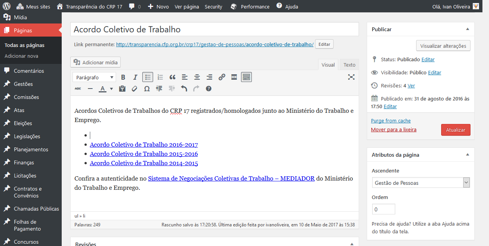
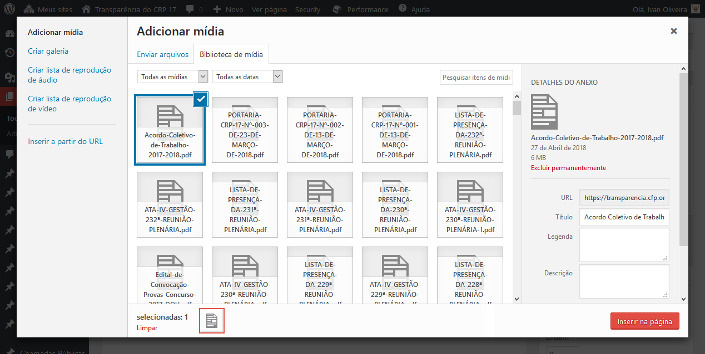

# Gestão de Pessoas

## Folhas de pagamentos

Para detalhes sobre a alimentação de Folhas de Pagamentos, consulte as instruções em [Folhas de Pagamentos neste manual](https://oliveiraivan.gitbooks.io/transparencia/content/gestao-de-pessoas/folhas-de-pagamentos.html).

## Acordo Coletivo de Trabalho

Para incluir/alterar um Acordo Coletivo de Trabalho siga os passos:

1. [Acesse o sistema](../../introducao/acessando_o_sistema.md)
2. No menu do painel clique no item **Páginas**
3. Encontre a página **Acordo Coletivo de Trabalho** e clique em **Editar**
4. Na **área do conteúto** (abaixo do título) deixe o cursor do mouse posicionado onde você deseja inserir o Acordo Coletivo de Trabalho (como são vários sugerimos que você organize como uma lista).\
   
5. Clique no botão **Adicionar mídia** .
6. Clique na aba **Enviar arquivos**, caso o arquivo em pdf esteja no seu computador.
7. Clique no botão **Selecionar arquivos** e navegue até onde se encontra o arquivo do Acordo Coletivo de Trabalho e clique em abrir.
8. Aguarde o upload (envio) do arquivo e após concluido realize as alterações nos **Detalhes do anexo** como o **Título** que é o texto do link para o arquivo pdf.\
   
9. Clique no botão **Inserir na página**
10. Realizada a inclusão/alteração clique no botão **Atualizar** para concluir

## Passagens

Área destinada para arquivo das Passagens aéreas.

Para incluir passagens, siga os passos:

1. [Acesse o sistema](../../introducao/acessando_o_sistema.md)
2. No menu do painel clique no item **Passagens**
3. Clique no botão **Adicionar Novo**
4. Preencha o **Título** e o **Conteúdo**
5. Na caixa **Arquivos** (onde serão anexados os documentos) clique no botão **Adicionar Documento**
6. Na caixa **Documento** preencha o **Título** e adicione o arquivo (em pdf) clicando no botão **Adicionar Arquivo**, na próxima tela clique no botão **Selecionar arquivos**, depois que escolher o arquivo clique no botão **Inserir no post**
7. Para adicionar mais arquivos repita os passos 5 e 6 quantas vezes forem necessárias
8. Na caixa **Publicar** edite a data de publicação clicando no link **Editar** (que fica na frente do texto 'Publicar imediatamente') para o seu correto arquivamento

**DICA**: Para colar o texto sem formatação ative o botão **Colar como texto** antes de colar.

**DICA:** Além do arquivo em PDF é uma recomendação do TCU incluir também uma versão em CSV ([você pode fazer isso pelo Microsoft Excel](https://support.office.com/pt-br/article/Criar-ou-editar-arquivos-csv-para-importa%C3%A7%C3%A3o-para-o-Outlook-4518d70d-8fe9-46ad-94fa-1494247193c7)).

**DICA:** Se você não sabe os campos obrigatórios para a planilha de passagens, você pode [conferir esse exemplo](https://transparencia.cfp.org.br/wp-content/uploads/2016/11/passagens-aereas-2016-11.pdf).

**Atenção:** Não deixe apenas números no campo Link permanente, pois isso pode causar um erro ao visualizar.

## Diárias e Auxílios de Representação

A área de Diárias e Auxílios de Representação não precisa ser alimentada diretamente. Pesquisas nesta área na verdade trazem dados da Relação de Pagamentos, só que aqui agrupados por destinação.

As destinações dos pagamentos devem ser definidas no painel entrando em Importação - SCP -> Prestação de Contas -> Alterar Contas de Pagamento. Para detalhes, consulte as instruções em [Prestação de Contas neste manual](https://oliveiraivan.gitbooks.io/transparencia/content/financas/prestacao-de-contas.html), na seção 3: Alterar contas de pagamento.
