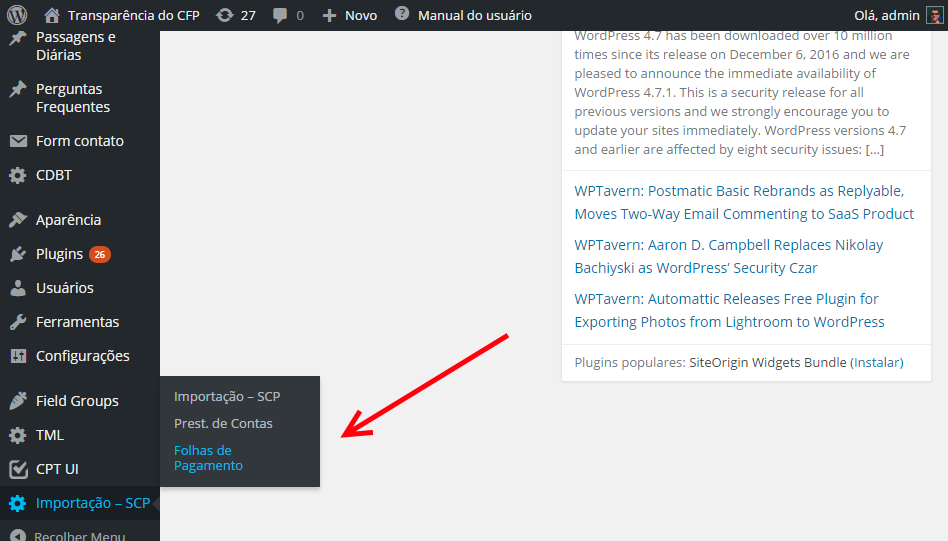
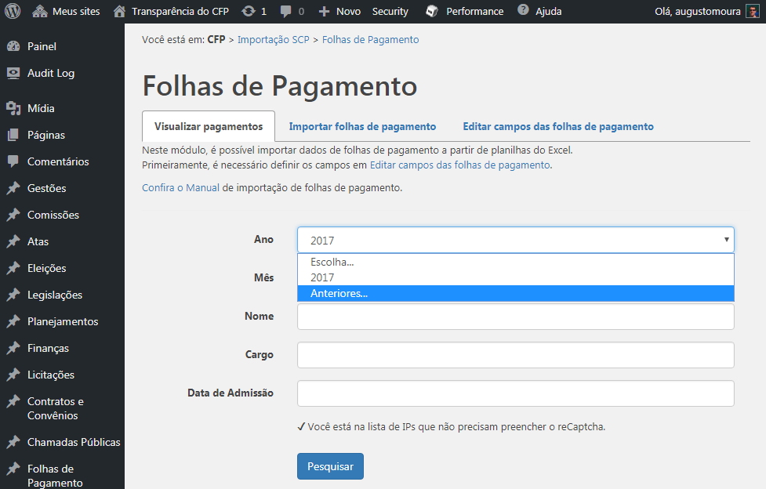
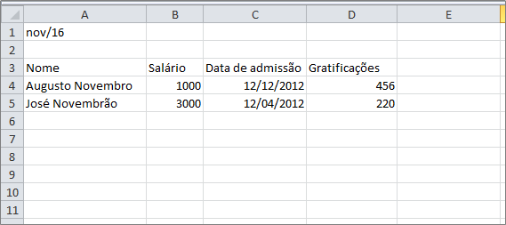
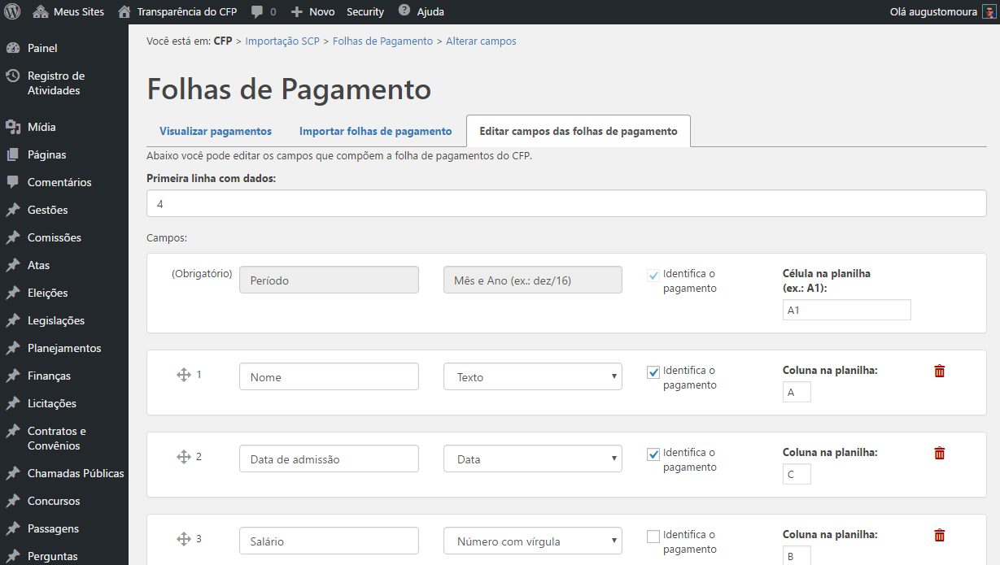
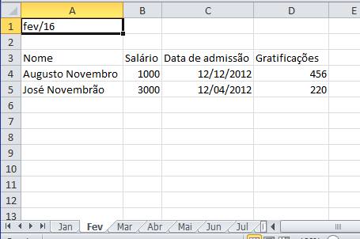
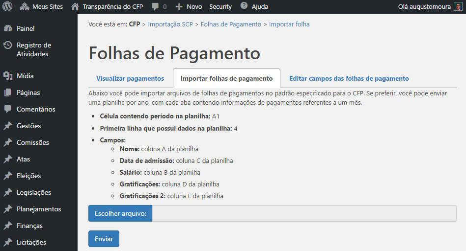

# Folhas de Pagamentos

_Inserir folhas de pagamentos de funcionários no banco de dados a partir de planilhas XLS_

As folhas de pagamento não devem apenas constar como arquivos PDF por mês e ano: cada pagamento deve ser armazenado separadamente e ao se visualizar deve ser possível pesquisar com parâmetros como ano, mês, nome do funcionário e função. Como cada Conselho Regional possui campos diferentes em suas folhas de Pagamento, foi desenvolvida uma solução que atende cada caso.

Para preencher o banco de dados com tais pagamentos, o setor responsável deve organizar a folha de pagamento de um mês e ano específico em uma planilha XLS com um determinado formato, que será explicado mais à frente. A importação e a edição das informações é feita com plugin Importação – SCP no painel de administração.

\
&#xNAN;_&#x41;cessando o plugin Importação - SCP no painel de administração._

## Informações gerais

Cada regional possui seu conjunto de campos na folha de pagamentos. Esses campos devem ser editados na seção “Alteração dos campos da Folha de pagamento”. Com os campos definidos, deve-se acessar a seção “Importar folha de pagamentos”.

O sistema, então, possui 3 áreas, cada um com sua aba na parte superior da página:

* Visualizar pagamentos
* Editar campos das folhas de pagamento
* Importar folhas de pagamento

## Visualizar pagamentos (página inicial)

Na página de visualizar pagamentos é exibido um formulário para visualização dos campos e dados definidos, na maneira como eles serão exibidos no portal da transparência. Todas as informações exibidas são referentes apenas ao CRP em cujo painel o usuário está.

É preferencial que o CRP alimente todas as folhas de pagamento neste formato, mas caso existam informações de folhas de pagamento já alimentadas no portal via painel do WordPress com posts do tipo Folhas de Pagamentos (Ex.: [https://transparencia.cfp.org.br/folha-de-pagamento](https://transparencia.cfp.org.br/folha-de-pagamento/) ), será exibida uma opção no campo Ano chamada "Anteriores...", que redirecionará o usuário para a área com as folhas de pagamento mais antigas.

Para cada pagamento a funcionário, é exibido um cabeçalho com o resumo do pagamento, que contém os campos registrados como "Identifica o pagamento" em "Editar campos das folhas de pagamento". Ao clicar no cabeçalho, todos os campos são exibidos

_Página inicial do módulo de importação de Folhas de Pagamento_

## Editar campos das folhas de pagamento

Antes de analisar a tela de alteração de campos, veja o exemplo de formato de uma planilha a ser importada, aberta no Microsoft Excel.

\
&#xNAN;_&#x45;xemplo de planilha para importação de Folhas de Pagamento_

Perceba que o mês e ano estão na célula A1 e a primeira linha com dados é a linha 4.

\
&#xNAN;_&#xC1;rea de edição de campos da Folha de Pagamento_

De volta à tela de edição de campos, preencha o campo “**Primeira linha com dados**” com o valor correspondente. No caso do exemplo, é a linha 4.

Abaixo, você visualizará diversos retângulos, que simbolizam os campos. O primeiro, obrigatório, é o de mês e ano. A única coisa a ser modificada aqui é a **célula em que a informação se situa na planilha**. No caso do exemplo, é a célula A1.

Do segundo retângulo em diante, os campos são editáveis. Para cada um deles, você deve definir:

* **Posição**: ordem de exibição do campo na lista de campos ao ser exibido. Altere a posição clicando no ícone  de um campo e arrastando para cima ou para baixo. Perceba que o período é fixo e não pode ter sua posição modificada.
* **Nome do campo**: é o nome que será exibido. **CUIDADO!** Renomear um campo não afeta os dados associados a esse campo. Se você mudar o nome de um campo de “Salário” para “Nome”, os dados exibidos continuarão sendo os mesmos números com vírgula.
* **Tipo de dado**: define se o valor do campo será um número inteiro, número com vírgula, texto ou data.
* **Identifica o pagamento**: determina se o valor do campo deve ser mostrado também no resumo de pagamento. Desta maneira, campos que identificam o pagamento são exibidos nos cabeçalhos dos pagamentos em pesquisas na Transparência, mesmo antes de "abrir" para ver detalhes. Identificadores típicos, além de “período”, que é obrigatório, são: “Nome completo” e “Cargo”.\
  Atente para o fato de que o sistema não importa linhas da planilha que contenham valor vazio em colunas que identificam o pagamento.
* **Coluna na planilha**: determina a coluna (no formato alfanumérico) nos arquivos XLS importados em que se encontra o dado. No caso do exemplo, “Nome” se encontra na coluna A.

Você pode mudar a quantidade de campos :

* Clicando no ícone de lixeira () para apagar um campo indesejado. **ATENÇÃO!** Ao apagar um campo, os dados  associados a ele continuarão sendo exibidos em pagamentos já existentes. A função de remover um campo deve ser usada quando um campo deixar de pertencer à folha de pagamento a partir de um certo mês.
* Clicando no botão “Novo Campo” na área inferior.

Após realizar as operações de adição, remoção ou edição dos campos que desejar, você precisa salvá-las clicando em "Salvar" na parte inferior da página.

## Importar Folhas de pagamento

Nesta área é possível importar as planilhas no formato definido na área de Alteração de Campos. Tais definições são mostradas ao usuário, como na imagem abaixo, e abaixo disso o campo de envio de arquivo. Escolha o arquivo, clique em Enviar, e aguarde a mensagem de sucesso ou de erro. Atente para o fato de que **o sistema não importa linhas da planilha que contenham valor vazio em colunas que identificam o pagamento**.

**ATENÇÃO!** Ao importar uma planilha referente a, por exemplo, janeiro de 2017, os dados deste período que já estavam no banco de dados serão apagados e substituídos pelos dados do novo arquivo!

Se a planilha enviada possuir **mais de uma aba**, o sistema de importação vai considerar cada aba como uma planilha diferente. Isso significa que você pode importar todas as folhas de pagamento de um ano com apenas um arquivo, desde que cada mês esteja em uma aba diferente, e que em cada uma delas a célula contendo período seja preenchida corretamente.

\
&#xNAN;_&#x45;xemplo de planilha com diversas abas, cada uma contendo os pagamentos de um mês do ano de 2016._

Lembrete: o período deve estar na célula especificada, contendo valor de mês e ano. Isso é realizado, no Excel, preenchendo no formato Mês/Ano. Ex.: 02/2017

\
&#xNAN;_&#xC1;rea de importação de arquivos XLS_
