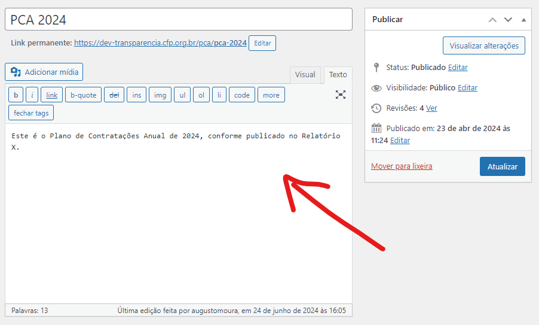

# Licitações e Contratos

## Introdução

Até 2021, a Lei Nº 8.666/1993 era a Lei vigente para Licitações e Contratos da administração pública. Em tal ano, entrou em vigência a Lei 14.133/2021, a Nova Lei de Licitações e Contratos Administrativos, que atribui aos Conselhos Regionais de Psicologia (CRP) e ao Conselho Federal de Psicologia (CFP) a obrigação de divulgar as atividades no Portal Nacional de Contratações Públicas (PNCP).

Desde abril de 2024, a seção "Licitações e Contratos" do Portal da Transparência foi alterada com a adição de páginas que exibem os dados que constam no PNCP, mas ainda mantendo as páginas de visualização dos processos que seguem a lei 8.666/1993.

Abaixo, as instruções para alimentar os processos que seguem a Lei 8.666/1993 e a Lei 14.133/2021.

## Lei 8.666/1993

### Licitações

A inclusão das Licitações é feita através do Sistema de Gestão de Contratos ([http://www2.cfp.org.br/gestaocontrato](http://www2.cfp.org.br/gestaocontrato)), fornecido pelo CFP.

Caso já existam Licitações preenchidas da maneira antiga (via painel do Wordpress), será exibida uma opção "Anteriores..." na seleção de ano ao pesquisar que redirecionará o usuário à pagina com as licitações antigas.

Para obter acesso ao sistema, abra um chamado na Gerência de Tecnologia da Informação do CFP enviando e-mail para [tecnologia@cfp.org.br](mailto:tecnologia@cfp.org.br) .

### Contratos

A inclusão dos Contratos é feita através do Sistema de Gestão de Contratos ([http://www2.cfp.org.br/gestaocontrato](http://www2.cfp.org.br/gestaocontrato)), fornecido pelo CFP.

Caso já existam Contratos preenchidos da maneira antiga (via painel do Wordpress), será exibida uma opção "Anteriores..." na seleção de ano ao pesquisar que redirecionará o usuário à pagina com os contratos antigos.

Para obter acesso ao sistema, abra um chamado na Gerência de Tecnologia da Informação do CFP enviando e-mail para [tecnologia@cfp.org.br](mailto:tecnologia@cfp.org.br) .

### Convênios

A inclusão dos Convênios é feita através do Sistema de Gestão de Contratos ([http://www2.cfp.org.br/gestaocontrato](http://www2.cfp.org.br/gestaocontrato)), fornecido pelo CFP.

Caso já existam Convênios preenchidos da maneira antiga (via painel do Wordpress), será exibida uma opção "Anteriores..." na seleção de ano ao pesquisar que redirecionará o usuário à pagina com os convêniosantigos.

Para obter acesso ao sistema, abra um chamado na Gerência de Tecnologia da Informação do CFP enviando e-mail para [tecnologia@cfp.org.br](mailto:tecnologia@cfp.org.br) .

## Lei 14.133/2021

### Atas de Registro de Preços

As Atas de Registro de Preços podem ser preenchidas no PNCP utilizando o Comprasnet, sistema gratuito fornecido pelo Governo Federal, ou outro sistema que também seja integrado com o PNCP.

### Contratos

Os Contratos podem ser preenchidos no PNCP utilizando o [Contratos](https://contratos.comprasnet.gov.br), sistema gratuito fornecido pelo Governo Federal, ou outro sistema que também seja integrado com o PNCP.&#x20;

### Editais e Avisos de Contratação

Os Editais e Avisos de Contratação podem ser preenchidos no PNCP utilizando o Comprasnet, sistema gratuito fornecido pelo Governo Federal, ou outro sistema que também seja integrado com o PNCP.

### Planos de Contratação Anuais (PCA)

Os Planos de Contratação Anuais podem ser preenchidos no PNCP utilizando:

* [Planejamento e Gerenciamento de Contratações (PGC)](https://www.gov.br/compras/pt-br/sistemas/conheca-o-compras/sistema-de-planejamento-e-gerenciamento-de-contratacoes), sistema gratuito fornecido pelo Governo Federal;
* ou o futuro módulo de PCA do Gestão de Contratos, detalhado mais à frente;
* ou outro sistema que também seja integrado com o PNCP.

**Módulo de PCA no Gestão de Contratos**

O PGC, sistema gratuito oferecido pelo Governo Federal para PCAs, apresenta um certo nível de burocracia, e pode não ser o ideal para a realidade do CFP e dos Regionais. Por esse motivo, está planejado o desenvolvimento de um módulo de PCA no sistema de Gestão de Contratos, pela Gerência de Tecnologia da Informação.

O módulo de PCA no Gestão de Contratos incluirá integração com o PNCP e, como consequência, os dados lá alimentados serão exibidos automaticamente na área integrada de PCA no Portal da Transparência.

É importante frisar que a disponibilização do módulo está prevista para o ano de 2025.

#### Solução temporária para PCA

A opção padrão, por ora, para preencher os PCAs será no próprio Portal da Transparência, no painel interno do Portal da Transparência, sem integração com o PNCP.&#x20;

Para tal, deve-se acessar o painel interno do Portal da Transparência e, no menu à esquerda acessar a área Planos de Contratação Anuais.

<figure><figcaption></figcaption></figure>

Os campos obrigatórios para preenchimento de um PCA são:

* Título
* Ano
* Total estimado (formato: 12.345.678,90)
* Documentos (obrigatório pelo menos 1: CSV/Excel)

O campo aberto consiste na descrição do PCA, é um campo opcional que, se preenchido, será exibido na listagem e na exibição individual. Nele podem ser inseridas informações adicionais como links e referências.

<figure><figcaption></figcaption></figure>

**Por padrão, esta modalidade de preenchimento será habilitada.**&#x20;

Os Regionais que desejarem NÃO utilizar a solução temporária de PCA, e sim exibir os dados integrados com o PNCP, deverão abrir chamado na GTI, enviando e-mail com a solicitação para [tecnologia@cfp.org.br](mailto:tecnologia@cfp.org.br) .

Quando o módulo de PCA do Gestão de Contratos for disponibilizado, a solução temporária será desabilitada.

## Ambas as Leis

### Convênios

A inclusão das Convênios é feita através do Sistema de Gestão de Contratos ([http://www2.cfp.org.br/gestaocontrato](http://www2.cfp.org.br/gestaocontrato)), fornecido pelo CFP.

Para obter acesso ao sistema, abra um chamado na Gerência de Tecnologia da Informação do CFP enviando e-mail para [tecnologia@cfp.org.br](mailto:tecnologia@cfp.org.br) .

### Chamadas públicas

A inclusão de Chamadas Públicas é efetuada no painel interno do Portal da Transparência.

Chamadas públicas incluem mas não se limitam a:&#x20;

* Edital para auxílio financeiro de fornecimento de passagens, hospedagens, para apoio e realização de eventos científicos ou técnicos;
* Seleção de parecerista;
* Publicação de diretrizes para participação em eventos;

Para incluir uma nova Chamada Pública siga os passos:

1. [Acesse o sistema](../introducao/acessando_o_sistema.md)
2. No menu do painel clique no item **Chamadas Públicas**.
3. Clique no botão **Adicionar Nova Chamada Pública.**
4. Preencha o **Título;**
5. Preencha o **Conteúdo** com o objeto da Chamada Pública;
6. Na caixa **Arquivos** (onde serão anexados os documentos) clique no botão **Adicionar Documento**
7. Na caixa **Documento** preencha o **Título** e adicione o arquivo (em pdf) clicando no botão **Adicionar Arquivo.** Na proxima tela clique no botão **Selecionar arquivos**, escolha o arquivo e clique no botão **Inserir no post**
8. Para adicionar mais arquivos repita os passos 6 e 7 quantas vezes forem necessárias;
9. Na caixa **Publicar** edite a data de publicação clicando no link **Editar** (à frente do texto 'Publicar imediatamente') para o seu correto arquivamento

**Atenção:** Não deixe apenas números no campo Link permanente, pois isso pode causar um erro ao visualizar.

